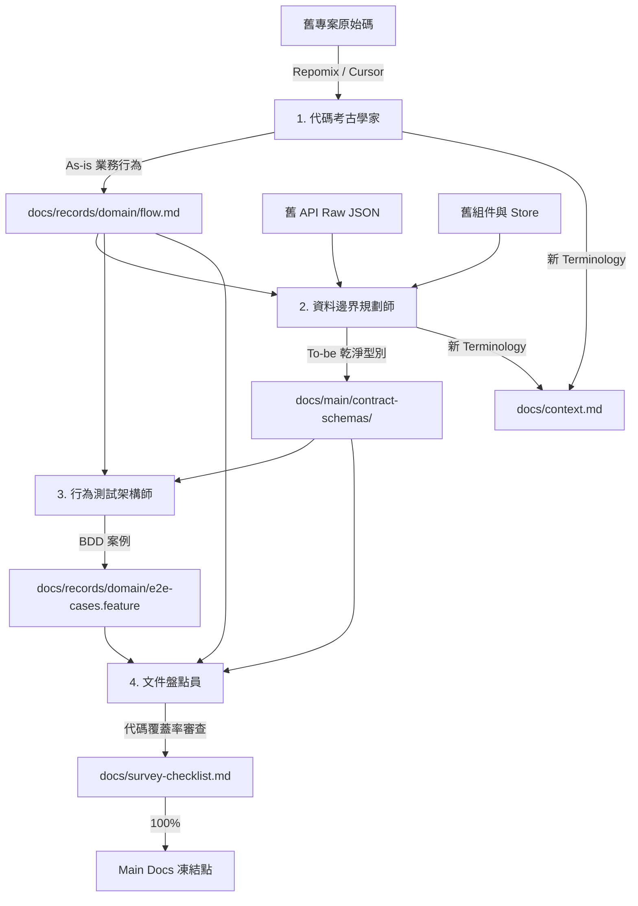

# Archaeology Docs

將舊專案原始碼提煉為結構化文件，存放於 `docs/`。

## 目錄結構

```
docs/
├── context.md               # 全域 Terminology（常駐不刪）
├── survey-checklist.md      # 檔案級考古進度（文件盤點員維護）
├── records/                 # 考古暫存區（凍結後可刪）
│   └── [domain]/
│       ├── flow.md          # As-is 業務行為
│       └── e2e-cases.feature# BDD 驗收案例
└── main/                    # 永久事實來源 (SSOT)
    ├── flows/               # 核心業務流程
    ├── pages/               # 頁面與區塊邏輯
    └── contract-schemas/
        ├── shared/          # 全域 Entities
        └── endpoints/       # API Input/Output + Transformer
```

## 文件流向



## 四角色規範

### 1. 代碼考古學家 (Code Archaeologist)

**Input**：舊專案特定路由/組件原始碼（Repomix 打包）

**Output**：`docs/records/[domain]/flow.md`

必含三區塊：

```markdown
### Happy Path
極簡使用者成功操作步驟。

### Edge Cases
所有業務邏輯 if-else 分支（排除網路斷線等基建錯誤）。

### Unverified Logic
有寫但無人踩到、或無法解釋的死碼/神祕邏輯。
```

### 2. 資料邊界規劃師 (Data Boundary Planner)

**Input**：
1. 舊 API Raw JSON Payload
2. `docs/records/[domain]/flow.md`
3. 舊組件資料轉換/衍生計算邏輯
4. 舊 Store 觸發源與衍生狀態

**Output**：`docs/main/contract-schemas/endpoints/[endpoint-name].md`

必含：
- **Upstream Raw JSON Schema**（TypeScript type）
- **Target TypeScript Interface**（JSDoc 標註 `@upstream_source`、`@old_logic_location`）
- **Transformer Pure Functions**（可執行的 TS 轉換函數原型）

### 3. 行為測試架構師 (Behavior Test Architect)

**Input**：
1. `docs/records/[domain]/flow.md`
2. `docs/main/contract-schemas/`

**Output**：`docs/records/[domain]/e2e-cases.feature`

規格：
- Gherkin (Given-When-Then) 語法
- 涵蓋所有業務層 Edge Cases
- **排除**網路斷線、404/500 等基建錯誤（由 API Client 統一處理）

全域約束收攏至：`docs/records/global-constraints/e2e-cases.feature`

### 4. 文件盤點員 (Documentation Auditor)

**Input**：舊專案檔案清單、`docs/records/` 已產出文檔

**Output**：更新 `docs/survey-checklist.md`

勾選標準：模組下**所有** `.ts` / `.tsx` 已盤點，且每隻 API 都有 contract-schemas 與 BDD 案例。

## 盤點優先順序

1. **核心業務流程**：Booking Flow、Search & Filter、Coupon / Affiliate
2. **靜態與內容頁**：導覽、FAQ、Top Page（只需 `docs/main/pages/` 列表，不需 contract-schemas / BDD）
3. **全域基礎設施**：Session 有效期、錯誤嘗試限制、URL 狀態同步

## Main Docs 凍結點

**第一階段（考古期）**：
- `records/` 記錄 As-is
- `main/flows/` 寫入確認過的 As-is 邏輯
- `main/contract-schemas/` 產出 To-be 純淨型別
- `survey-checklist.md` 達 100% → **凍結**，與 PM 進行技術變更討論

**第二階段（重構期）**：
- 新需求直接修改 `docs/main/`（To-be 終點狀態）
- PR 附帶 `CHANGELOG.md`（Ticket link + 修改文件清單）
- 程式碼上線時文檔一併 Merge

## Figma Token 三層防線

| 層級 | 範例 | 設計師權限 |
|------|------|-----------|
| Primitive | `primitive/neutral/100` | 禁止直接綁定畫布 |
| Brand | `brand/primary` | 禁止直接綁定畫布 |
| Semantic | `semantic/bg/base` | **唯一合法** |

Figma 組件 Description 必須備註 i18n key，例如：`[i18n-key] booking.field.code_placeholder`
